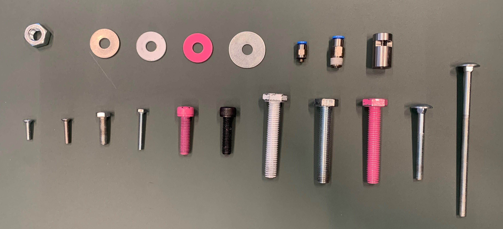

# A model for classifying Nuts, Bolts & more...

## Table of Contents

+ [Introduction](#introduction)
+ [Getting Started](#getting_started)
    + [Prerequisites](#prerequisites)
+ [General Layout](#general_layout)
+ [How to run](#how_to_run)


## Introduction <a name = "introduction"></a>



As you can see there are 19 different objects we need to identify. We chose for 5 classes with the following information per class.

### Different classes:

1. Nuts
    - Position
    - Oriëntation
2. Bolts
    - Position
    - Oriëntation
    - Size
    - Color
    - Type
3. Ring
    - Position
    - Size
    - Color
4. Check Valve (Festo)
    - Position
    - Oriëntation
    - Size
5. Metal Attachment
    - Position
    - Oriëntation

## Getting Started <a name = "getting_started"></a>

### Prerequisites  <a name = "prerequisites"></a>

for all the Prerequisites, I would suggest downloading all the requirements.txt file with:

```ShellSession

$ pip install -r requirements.txt
```

if there are any problems please open a ticket or send me a message.

## General Layout <a name = "general_layout"></a>

```bash
├── input_conventional <- here are the input images for conventional image processing
│   ├── img_1.jpg
│   ├── img_2.jpg
│   ├── [etc].jpg
├── output_conventional <- these are the output images for conventional image processing
│   ├── img_1.jpg
│   ├── img_2.jpg
│   ├── [etc].jpg
├── test_images_1 <- dataset from first shoot
│   ├── img_1.jpg
│   ├── img_2.jpg
│   ├── [etc].jpg
├── test_images_2 <- dataset from second shoot
│   ├── img_1.jpg
│   ├── img_2.jpg
│   ├── [etc].jpg
├── test_images_crossed <- small dataset for crossed objects
│   ├── img_1.jpg
│   ├── img_2.jpg
│   ├── [etc].jpg
├── test_images_val <- just an image for the README.md
│   ├── val_image.jpg
├── Conventional.py <- file to run for identifying objects and there features using conventional methods
├── DeepLearning.py <- file to run for identifying objects and there features using deep learning
├── README.md
└── requirements.txt
```

By the time of this writing we are still making the deep learning algoritm.

## How to run <a name = "how_to_run"></a>

if you've installed everything correctly you should be able to run the application with:

```ShellSession

$ python ./Conventional.py
```

or 

```ShellSession

$ python ./DeepLearning.py
```

Depending on your preference. 

**NOTE**: We expect you to run these commands home dir of the repo.