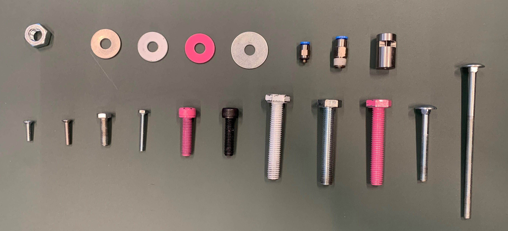

# A model for classifying Nuts, Bolts & more...

## Table of Contents

+ [Introduction](#introduction)
+ [Getting Started](#getting_started)
    + [Prerequisites](#prerequisites)
+ [General Layout](#general_layout)
+ [How to run](#how_to_run)


## Introduction <a name = "introduction"></a>
The idea of this project is to identify these objects using regular (conventional) image processing algorithms, and identify the objects using deep learning. To see the advantages and disadvantages of both.



As you can see there are 19 different objects we need to identify. We chose for 5 classes with the following information per class. 

### Different classes:

1. Nuts
    - Position
    - Oriëntation
2. Bolts
    - Position
    - Oriëntation
    - Size
    - Color
    - Type
3. Ring
    - Position
    - Size
    - Color
4. Check Valve (Festo)
    - Position
    - Oriëntation
    - Size
5. Metal Attachment
    - Position
    - Oriëntation

## Getting Started <a name = "getting_started"></a>

### Prerequisites  <a name = "prerequisites"></a>

for all the Prerequisites, I would suggest downloading all the requirements.txt file with:

```ShellSession

$ pip install -r requirements.txt
```

if there are any problems please open a ticket or send me a message *(The requirements are made with pipreqs)*.

## General Layout <a name = "general_layout"></a>

```bash
├── conventional
│   ├── input_conventional <- here are the input images for conventional image processing
│   │   ├── img_1.jpg
│   │   ├── ...
│   ├── output_conventional <- these are the output images for conventional image processing
│   │   ├── img_1.jpg
│   │   ├── ...
│   ├── Conventional.py <- file to run for identifying objects and there features using conventional methods
│
├── deep_learning
│   ├── dataset <- our dataset (roughly 450 images)
│   │   ├── img_1.jpg
│   │   ├── img_2.jpg
│   │   ├── ...
│   │   
│   ├── DeepLearning.py <- file to run for identifying objects and there features using deep learning
│
├── image_objects_ordered <- just an image for the README.md (can be used for validation)
│   ├── val_image.jpg
│
├── README.md
└── requirements.txt
```

By the time of this writing we are still making the deep learning algoritm (Using Detectron 2).

## How to run <a name = "how_to_run"></a>

if you've installed everything correctly you should be able to run the application with:

```ShellSession

$ python ./Conventional.py
```

or 

```ShellSession

$ python ./DeepLearning.py
```

Depending on your preference. 

**NOTE**: We expect you to run these commands in the home dir of the repo.